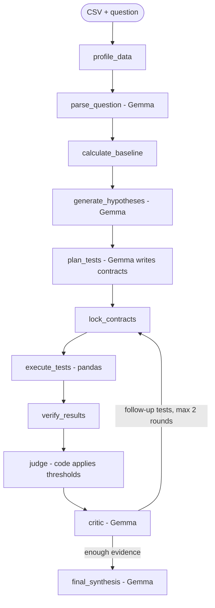

# Argue With My Data

> An AI data analyst that tries to prove its own explanation wrong before it answers. Upload a CSV, ask why a metric changed, and it tests competing explanations with deterministic calculations to show which ones the evidence supports.

## Team

**Team Name:** [Team Name]


| Member | Contribution   |
| ------ | -------------- |
| [Name] | Analysis engine: deterministic analysis tools, verdict logic |
| [Name] | Demo dataset, submission, pitch |
| [Name] | Gemma agents: question parsing, hypotheses, test planning, critic, synthesis |
| [Name] | LangGraph orchestration, Streamlit UI, deployment |


## Problem Statement

### The Problem

When a business metric changes, people ask "why?". AI data assistants are good at producing a plausible answer, such as "revenue fell because Customer X stopped ordering". Plausible isn't the same as correct. A single dramatic event can explain only a small part of a change, while the real driver is spread thinly across the data. Analysts, managers and founders who act on the plausible answer make the wrong decision.

### Why We Chose This Problem

[Team: add your reason in your own words.]

## Solution

Argue With My Data treats a "why" question as an investigation. It proposes several competing explanations, writes down in advance what result would support or reject each one, runs deterministic tests on the data, and only then reports which explanations hold up, including which ones it couldn't test.

### Key Features

- **Competing hypotheses:** several explanations are tested, not just the first plausible one.
- **Falsification contracts:** each test and its pass/fail thresholds are fixed and locked before the test runs.
- **Deterministic evidence:** every number comes from pandas, not from the language model.
- **Honest verdicts:** SUPPORTED, WEAKENED, REJECTED or UNTESTABLE, with an evidence trace for each.

## Innovation and Differentiation

Most AI data tools return an answer. This one has to argue against its own answers before it gives one. The language model proposes explanations and tests, but code computes the evidence and code applies the pre-committed thresholds, so the model can't move the goalposts after seeing the results. The system can also say a question is untestable with the available data.

## Technical Implementation

### Architecture



### Technology Stack


| Category        | Technologies                |
| --------------- | --------------------------- |
| Frontend        | Streamlit, Plotly           |
| Backend         | Python, LangGraph           |
| Database        | N/A                         |
| AI / ML         | Gemma (via the Gemini API)  |
| Infrastructure  | Streamlit Community Cloud   |
| APIs / Services | Google Gemini API           |


### How It Works

[To be completed as components are finished.]

### Technical Decisions

- **The LLM never calculates.** Gemma proposes and explains; pandas computes every number shown.
- **Verdicts are applied in code** from thresholds fixed before each test runs.
- [Team: add further decisions.]

## Implementation During the Hackathon

[To be completed at the end of the Hack Day.]

### Team Contributions

- **[Member Name]:** [Contribution]
- **[Member Name]:** [Contribution]
- **[Member Name]:** [Contribution]
- **[Member Name]:** [Contribution]

## Working Application

**Live Application:** [Live URL]

[Briefly explain how the deployed application can be accessed and what functionality can be tested.]

## Demo Video

**Demo Video:** [Video URL]

## Open Source and AI Usage

### AI / Models

- **Gemma (Google):** parses the question, proposes hypotheses, plans tests, critiques results and writes the final explanation. It does not compute numbers or assign verdicts.
- **AI coding assistants:** Claude Code (Anthropic) was used for project setup, planning and parts of the analysis engine. [Team: list every other AI tool used while coding, e.g. Codex.]

### Open Source Components

- **LangGraph:** orchestration of the investigation graph
- **pandas, NumPy:** data analysis
- **Pydantic:** validation of model output
- **Streamlit, Plotly:** user interface and charts
- **Demo dataset:** synthetic, generated by `scripts/generate_data.py`

## Setup and Usage

### Prerequisites

- Python 3.11+
- A Google AI Studio API key with access to a Gemma model

### Installation

```bash
git clone https://github.com/kris-mediAI/Argue-with-Data.git
cd Argue-with-Data
python -m venv .venv && source .venv/bin/activate
pip install -r requirements.txt
```

### Environment Variables

```env
GEMINI_API_KEY=your-key
GEMMA_MODEL=gemma-model-name
REPLAY=0
```

Copy `.env.example` to `.env` and fill it in. Never commit `.env`.

### Running the Project

```bash
streamlit run app.py
```

### Usage

[To be completed once the app runs.]

## Challenges and Learnings

[To be completed at the end of the Hack Day.]

## Devpost Submission

**Devpost Project:** [Devpost Project URL]

## Credits and License

### Credits

LangGraph, pandas, NumPy, Pydantic, Streamlit, Plotly, and Google's Gemma models.

### License

[To be chosen by the team.]

## Submission Checklist

- [ ] Project title and description added
- [ ] All team members listed
- [ ] Problem clearly explained
- [ ] Reason for choosing the problem explained
- [ ] Solution and key features documented
- [ ] Innovation and differentiation explained
- [ ] Architecture included
- [ ] Technical implementation documented
- [ ] Work completed during the hackathon documented
- [ ] Team contributions documented
- [ ] Working application is functional
- [ ] Live application link added where applicable
- [ ] Demo video added
- [ ] AI and open-source components documented
- [ ] Setup and usage instructions tested
- [ ] Challenges and learnings documented
- [ ] Devpost submission completed
- [ ] Devpost link added
- [ ] Credits added
- [ ] License added
- [ ] Repository is organized and complete
