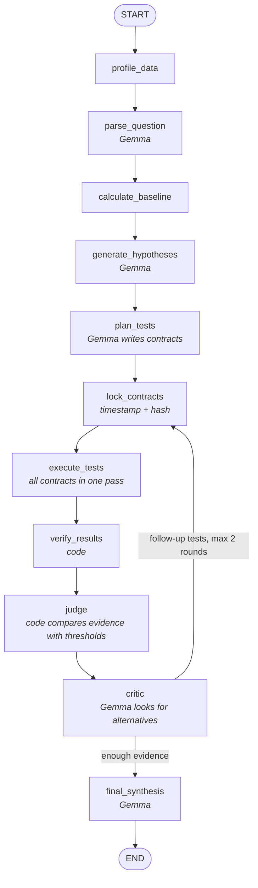

# Team plan (5-hour Hack Day)

**LLM proposes. LangGraph orchestrates. Python calculates. Critic challenges. Evidence decides.**

Argue With My Data takes a CSV and a question like "Why did revenue fall in March?", proposes competing explanations, and tries to falsify each one with deterministic tests before answering. The live demo must show a plausible explanation (Customer X stopped ordering) being **weakened** by the evidence, and a better one (product mix) being **supported**.

Read [AGENTS.md](../../AGENTS.md) too. It holds the Hack Day rules every coding agent must follow: no secrets in git, no made-up results, README kept accurate.

## Roles

| | Role | Brief | Owns |
|---|---|---|---|
| P1 | Analysis engine | [P1-analysis-engine.md](P1-analysis-engine.md) | `analysis/`, `tools/`, `fixtures/evidence/` |
| P2 | Data, story and submission | [P2-data-story-submission.md](P2-data-story-submission.md) | `data/`, `scripts/`, `README.md`, demo video, Devpost |
| P3 | Gemma agents | [P3-gemma-agents.md](P3-gemma-agents.md) | `agents/`, `prompts/`, `fixtures/contracts/`, `fixtures/llm_cache/` |
| P4 | LangGraph and UI | [P4-langgraph-ui.md](P4-langgraph-ui.md) | `graph/`, `ui/`, `app.py`, `requirements.txt`, deployment |
| all | Shared formats | | `models/schemas.py` (tell the team before changing it) |

Commit only inside your own folders. Work on a branch named after your role (`p1-analysis`, `p2-data`, `p3-agents`, `p4-graph-ui`), and merge to `main` small and often.

## The graph

Changes from the original Codex prompt, and why:

- **`execute_tests` runs every contract in one pass.** The loop exists only for the critic's follow-up tests. Running one test per loop, with a 2–3 round cap, would leave hypotheses untested.
- **Verdict labels come from `judge()` in code**, comparing the measure with the contract's thresholds. Gemma's critic suggests alternative explanations and follow-up tests; it does not pick labels. An LLM labelling after seeing the numbers is exactly what the project argues against.
- **`verify_results` is code**: parts add up to the total, periods exist, the evidence matches the contract's tool.
- **Contracts are locked** (timestamp + hash) before any test runs, and the UI shows the lock before the result.
- **Pandas only; no DuckDB or LangChain.** LangGraph works without LangChain, and DuckDB duplicates pandas at this data size. Add either back only if a judging rule requires it.

## Verdict rules

`measure` = the share of the total change a hypothesis accounts for, signed so positive means "same direction as the total change". It can exceed 1 or go below 0; don't clip it.

| Verdict | Rule (defaults, set per contract) |
|---|---|
| SUPPORTED | measure ≥ 0.40 |
| WEAKENED | 0.05 ≤ measure < 0.40 |
| REJECTED | measure < 0.05, including the opposite direction |
| UNTESTABLE | the test returned `untestable` or `error` |

Gemma may set `support_at_least` between 0.25 and 0.60 per contract, before it's locked.

## Timeline (from when you start)

| Time | What happens |
|---|---|
| 0:00–0:20 | Everyone pulls `main` and reads their brief. **P3 checks that Gemma returns valid structured JSON** (the biggest technical risk). |
| 0:20–2:00 | Build alone against fixture files. |
| **2:00** | **Checkpoint: the graph runs end to end with no Gemma.** Agent nodes return hardcoded hero values; tools, `judge` and the UI are real. Customer X WEAKENED, product SUPPORTED. **P4 deploys this version to Streamlit Community Cloud** so deployment problems show up early. |
| 2:00–3:30 | Gemma connected end to end, final synthesis added. |
| 3:30–4:00 | Critic follow-up loop, "Your theory" box, dataset switch, only if on schedule. Save Gemma responses for replay. |
| 4:00 | **Freeze.** Bug fixes only. |
| 4:00–4:30 | Record the demo video. Redeploy. |
| 4:30–5:00 | README complete, Devpost submitted, links checked. |

If something slips, cut scope from the next block. Never skip the 2:00 checkpoint.

## Handoffs

| From → To | What | By |
|---|---|---|
| P1 → P3, P4 | Sample Evidence JSON per tool, `TOOL_SPECS` | 0:45 |
| P3 → P4 | `fixtures/contracts/hero.json` | 0:45 |
| P2 → P1, P4 | `data/demo_sales.csv` + `data/answer_key.json` | 1:00 |
| P3 → everyone | Does Gemma return valid structured JSON? | 0:20 |
| P1 → P4 | `run_tool`, `verify`, `judge` on real data | 2:00 |
| P3 → P4 | Agent functions | 3:00 |
| P4 → P2 | Live URL | 2:15 |

## Ground rules

- No number on screen comes from Gemma.
- A contract is locked before its test runs and never edited afterwards.
- Never commit `.env` or API keys. Keys go in `.env` locally and in Streamlit secrets when deployed.
- `main` always runs.
- Note every AI tool you use while coding (Codex, Claude Code, etc.). MLH requires listing them in the submission.

## On stage

P2 pitches. P4 drives the laptop. P1 answers "Where do the numbers come from?" P3 answers "What does the AI actually do?"
